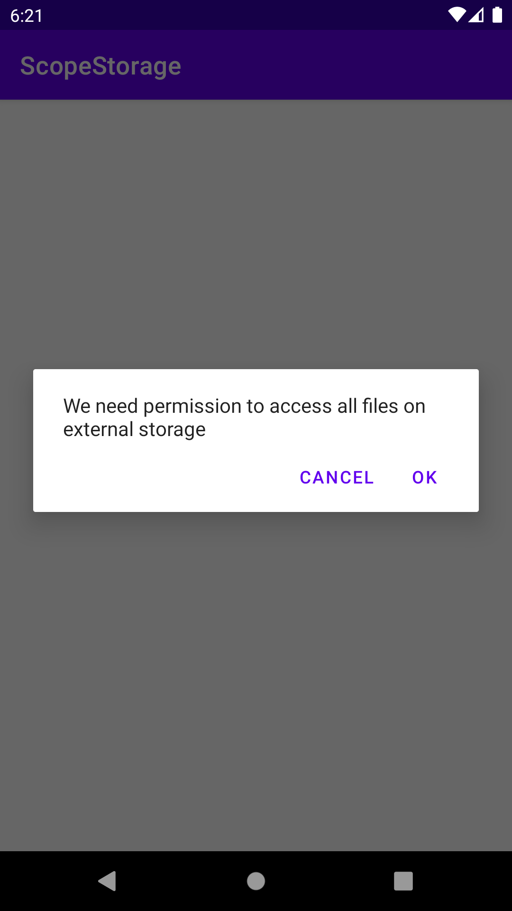
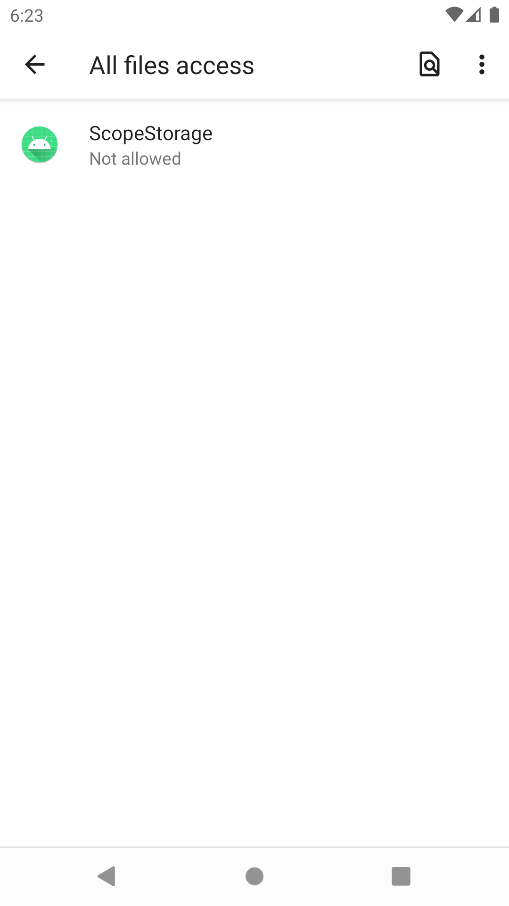

<h1>Introduction</h1>
INTUZ is presenting an ScopeStorage Permission for android 11 to integrate inside your native Android-based application. 
ScopeStorage is a simple component, which lets you easy for access andorid 11 file access permission. 
  
<h1>Features</h1>

- Easy & Fast Integrate.
- Just you need to pass context.
- You can get easily permission by one click.

**<h1>Bugs and Feedback</h1>**
For bugs, questions and discussions please use the Github Issues.

  
**<h1>License</h1>**
The MIT License (MIT)
  
Copyright (c) 2020 INTUZ
  
Permission is hereby granted, free of charge, to any person obtaining a copy of this software and associated documentation files (the "Software"), to deal in the Software without restriction, including without limitation the rights to use, copy, modify, merge, publish, distribute, sublicense, and/or sell copies of the Software, and to permit persons to whom the Software is furnished to do so, subject to the following conditions: 
  
THE SOFTWARE IS PROVIDED "AS IS", WITHOUT WARRANTY OF ANY KIND, EXPRESS OR IMPLIED, INCLUDING BUT NOT LIMITED TO THE WARRANTIES OF MERCHANTABILITY, FITNESS FOR A PARTICULAR PURPOSE AND NONINFRINGEMENT. IN NO EVENT SHALL THE AUTHORS OR COPYRIGHT HOLDERS BE LIABLE FOR ANY CLAIM, DAMAGES OR OTHER LIABILITY, WHETHER IN AN ACTION OF CONTRACT, TORT OR OTHERWISE, ARISING FROM, OUT OF OR IN CONNECTION WITH THE SOFTWARE OR THE USE OR OTHER DEALINGS IN THE SOFTWARE.

 
<h1></h1>

